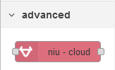
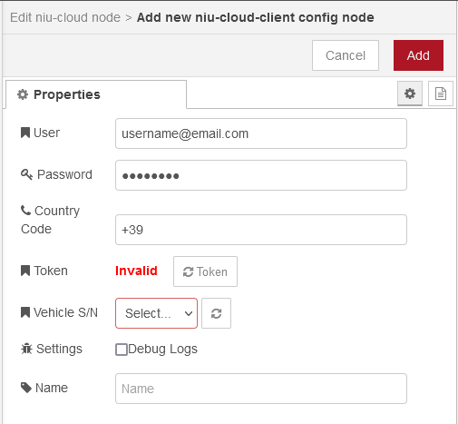
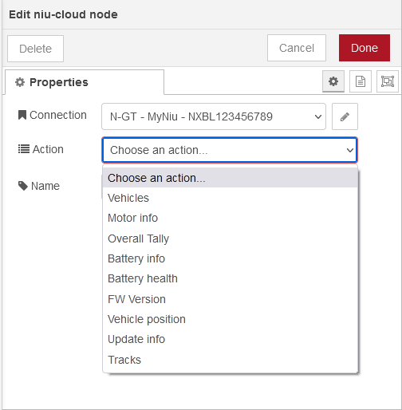

# node-red-contrib-niu-cloud

A [Node-RED](https://nodered.org/) library for connect to NIU Cloud for your electric scooter

__________

## NIU Cloud connector for Node-RED
This library allows you to request information about your vehicle from the NIU Cloud. It handles many actions that can be performed on multiple vehicles. 

To install this library please search for "niu" in the node palette 

### Supported actions

**Vehicles** Get a list of vehicles.\
**Motor info** Get motor info of vehicle.\
**Overall Tally** Get overall tally of vehicle.\
**Battery info** Get battery info of vehicle.\
**Battery health** Get battery health of vehicle.\
**FW Version** Get firmware version.\
**Vehicle position** Get current position of a vehicle.\
**Update info** Get update information.\
**Tracks** Get recorded tracks.

For information on the data that all actions return, see the API description [here](https://github.com/BlueAndi/niu-cloud-connector/blob/master/doc/API.md)

### Changelog

See the [changelog](CHANGELOG.md) for all the details of each releases

### Node-RED palette

### How to use

Set your Niu Cloud Account credential and click on "refresh token", then select a vehicle and save the config note.

On the node, select the desired action and inject any payload to retrieve information from the Niu cloud 

### Debug

Use the verbose `-v` flag when starting Node-RED to get more information
or use `node-red-log` and enable "Debug Logs" on Configuration Node as needed

__________

## Attributions

The **node-red-contrib-niu-cloud** using nodejs library [**niu-cloud-connector**](https://github.com/BlueAndi/niu-cloud-connector) for all features.

## License
This project is released under The MIT License (MIT)
